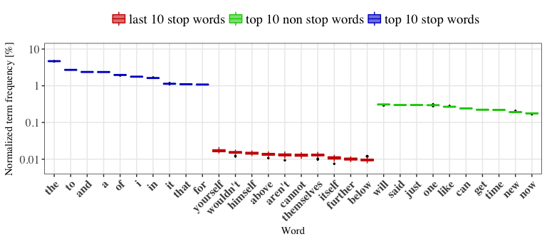

# Capstone Project: N-gram word prediction with R.
Dylan Tweed  
02/19/2017  


# Executive summary

The goal of this Capstone project is to create an application that can predict the next word the user is most likely to type, based on the previous (1, 2 or 3 words). To complete this project, we shall take advantage the  [Coursera-Swiftkey data set](https://d396qusza40orc.cloudfront.net/dsscapstone/dataset/Coursera-SwiftKey.zip). We build upon our previous work; [Milestone Report: Natural Language Processing towards a 3-gram trained prediction model](https://rpubs.com/BreaizhZut/MilesStone_NgramPrediction) and provide an accurate statistical analysis based on a sampling of the complete data-set into 100 sub-samples each representing 1% of the original data-set.

1. We explore the variation in frequency of the most frequent words distinguishing stop words and other words of the vocabulary. 
1. We explore the global impact of different kind of words:
    * We confirm the reliability of the dictionary building from  a larger sub-sample
    * We find similar fractions of text sampled by 146 stop words and the 6989 other dictionary words
1. We confirm the number of words required to explore the data-set, (we provide here the 90%  confidence intervals on 1% of the data-set)
    * 50% of the text is represented by 129 to 141 words, and 90% with 6638 to 6770 words.
    * If we first remove stop words these number rise to 939 to 998 for 50% and 12609 to 14901 for 90%
    * We note that the size of a dictionary build from 10% of the data-set is quite larger, suggesting a lingering dependence on the sub-sample size.
1. We explore the variation of the number of different terms (N-grams) found as a function of the number of words they contains.
    * if sentences are not split, the number of terms remains steady at 1.1 million (0.67 millions if stop words are removed), once we explore terms larger than 4 words.
    * if we impose N-grams to be contained within one sentence; the number of terms reaches a maximum at 4 words with 0.77 millions if stop words are included and at 3 words with 0.42 millions if they are not included.
1. We use these new findings to improve our previous prediction model strategy     

In order to keep this document concise, the main body is focused on results. An extensive [appendix](#appendix-supplementary-materials) describes the main functions developed for this project. This document, related scripts and relevant data files are also available on git hub:  [Capstone_NLP_NgramPrediction](https://github.com/BreizhZut/Capstone_NLP_NgramPrediction).

# Data: summary, sampling and processing

The data is a subset of the larger [HC Corpora](http://www.corpora.heliohost.org) corpus. It was made publicly available as the [Coursera-SwiftKey  DataSet](https://d396qusza40orc.cloudfront.net/dsscapstone/dataset/Coursera-SwiftKey.zip) for this Capstone project. 
The data is organized in 4 directories `lang` by languages: English (`en_US`); German: (`de_DE`); Finish: (`fi_FI`) and Russian: (`ru_RU`). Each directory contains 3 text files flagged as `news`, `blogs` and `twitter`.
We use only the English version, the text processing we apply is thus customized to the English language. We neglect to consider misspelled and foreign words that should not be frequent enough to represent a problem, or should be considered part of the language and vocabulary if they are frequent enough.

In order to do some basic text mining and explore the data we use the `tm` library (see [Basic Text Mining in R](https://rstudio-pubs-static.s3.amazonaws.com/31867_8236987cf0a8444e962ccd2aec46d9c3.html#just-the-basics) for more basic information).


We summarize the data in the following table.


Table: Summary of the 'final/en_US/' data set

                     Number of lines   Number of words   Number of characters
------------------  ----------------  ----------------  ---------------------
en_US.blogs.txt               899288          37334690              210160014
en_US.news.txt               1010242          34372720              205811889
en_US.twitter.txt            2360148          30374206              167105338
total                        4269678         102081616              583077241


As this data is quite large, we extract multiple subsets (see [appendix 5.1](#sampling)) as follows:<a id=samp></a>

* a 10% sub-sample `sample_1` corresponding to 10% of the complete data-set
* 100 independent sub-samples `sample_001` to `sample_100` corresponding to a division of the complete data-set into 1% sub-sets. 

The text processing now implemented varies little from our previous work. The most notable difference is that a sentence marker is now incorporated. This step is extremely relevant while we consider N-grams of various lengths. The different transformations applied to the text are described in detailed in [appendix 5.2](#text-processing)<a id=proc></a>.
We  illustrate the text processing on 1% of the full data-set. 

```r
test_corpus <- Corpus(DirSource("sample_001"))
```

Starting from a corpus 106902 terms of the processing consists in the following steps:


* Removing terms interpreted as Unicode, emails, twitter links or web addresses and changing to lower case. We go down to 104468 terms.

```r
test_corpus <- tm_map(test_corpus,content_transformer(remove_junk))
test_corpus <- tm_map(test_corpus,content_transformer(tolower))
```

* Replacing all non alphabetical characters except apostrophe "`'`" and sentence marks "`.`","`!`" and "`?`". We go down to 69240 terms.

```r
test_corpus <- tm_map(test_corpus,content_transformer(remove_symbols))
```

* Adding a "`<stop>`" at the end of each entry to ensure that each entry is at least defined as n individual sentence independent from any other entry. We obtain at this stage 69146 terms, this step is only used for training on a corpus.

```r
test_corpus <- tm_map(test_corpus,content_transformer(edit_line))
```

* Replacing punctuation "`.`","`!`" and "`?`" with "`<stop>`", we go down to 49886 terms.

```r
test_corpus <- tm_map(test_corpus,content_transformer(edit_punctuation))
```

* Adding a space before short-forms ("`'m`" and "`n't`" are neglected) we go down to 47810 terms.


```r
test_corpus <- tm_map(test_corpus,stripWhitespace)
```


This processing is quite efficient at cleaning the data, and significantly reduces the number of words (by 55% in this example). The text is further processed by stripping the extra white spaces with no effect on the term count. Additional functions can be applied to these corpus or to some text input.


* Removing stop words, we obtain 47668 terms

```r
test_corpus <- tm_map(test_corpus,removeWords,my_stopwords)
```


These processing stage have been applied to the 10% sample before constructing 2 dictionaries (see [appendix 5.3](#building-dictionaries)<a id=dic></a>:

* one representing 90% of the sub-sample including stop words (saved as `dictionary_1.txt`)
* one representing 90% of the sub-sample excluding stop words (saved as `dictionary_nostp_1.txt`)

With this dictionary, a new processing stage can be applied (here illustrated in the case where stop words are not removed). 

* Replacing all word not part of a dictionary by "`<naw>`"we obtain a corpus of 7140. That corresponds to  the number of words in the dictionary 7138 with the added flag words "`<stop>`" and "`<naw>`". 

```r
test_corpus <- tm_map(test_corpus,content_transformer(apply_dictionary))
```

This last step could be applied at a later stage for example on series of words (N-gram terms). We found that applying this dictionary filtering on the corpus itself strongly speeds up the computations especially if we extract terms of various lengths (number of words) from the same corpus.

# Exploratory Analysis 

We use the fact that we divided the data into 100 subsets, to compute accurate statistics on the data taking the sampling variance into account. The different functions constructed for generating this data are detailed in [appendix 5.4](#exploratory-analysis-codes).

## Word frequencies and sampled fractions

We first explore the most frequent words more precisely how the frequency of stop words may differ from those found for other words.
The figure show the frequencies of the most current stop words (blue) and most current non stop words (in green). The later are much less current than the top 10 stop words. However stop words are not necessarily among the most frequent words. We indeed show in red stop word with frequency close to 0.01 %. A simple frequency cut is thus not sufficient to separate stop words from the rest of the vocabulary. 




Even though they do not represent a large fraction of the vocabulary, the most frequent words tend to be stop words. We explore, among other group of words, the portion of the text they represent, we also use the dictionary built with stop words on the 10% sub-sample and single out the group of words that are not found in that dictionary. As we accomplish that we aim to highlight the portion of useful words that could be either a predictor variable or a prediction. 


* Our 179 stop words represent a large fraction 45% (49% for blogs, 43% for news and 44% for twitter)
* Profane words are extremely rare (usually about 11 words, they are more apparent on twitter (0.15%) than on blogs (0.152%) and hardly occur in news.  
* Other words found in the dictionary make up to 45% (41% for blogs, 46% for news and 48% for twitter.)
* The largest group (about 40972 words) are not found in the dictionary. By design they should not represent more than 10% of the corpus. This limit is represented by the dashed horizontal line. This rule is met for the corpus, and all documents except the news for which unknown words represents 10.9% of the text. This is not unexpected since the news is expected to have the largest vocabulary. 

We complete this part of the analysis with estimates of the size of dictionaries representing either 50% or 90% of the English language. These estimates are represented as histograms in the next figure. We not only consider the percentile of text represented (50% in blue, 90% in red) but also how removing stop words impact the dictionary.


* The number of words needed (135 and 6692 respectively) is not affected by the sampling variance.
* if stop words are deleted, the most current words are removed. To represent either 50% or 90% of these new text, we need a much larger number of words of the order of 972 and 14748 respectively. As these dictionaries include more and rarer words, they are much more affected by the sampling variance.

We find interesting to note that we have little variation on the size of a dictionary representing 90% (including stop words) on 1% of the data-set. However we build a similar dictionary on 10%  of the data-set with 7138 while our 90% confidence region on 1% would be 6638 to 6770. We conclude that the sampling variance is negligible compared to variation obtained using a larger sample. Only by constructing a dictionary on the full data set or explore the sampling variance on the 10% sub-sets could we conclude which estimate is the most representative of the data.

## Number of N-grams

This exploratory is the most useful to the project. Our prediction model will rely on a reliable identification and extraction of sequences of words of N-gram term. A 3 word prediction model would need to be trained on a large number of 4 words terms: the first 3 being used as input variables the last as the prediction.

We first explore the number of different term we can extract as a function of the  number of words they contain. 


1. In the left panel we ignore the structure of the text in terms on sentences and different inputs. For the three dictionary selection we implement, we found the same behavior with a rise in the number of term as we increase their length and a plateau for 4 words. As we apply a dictionary with stop word the plateau is lowered from 1.12 millions to 1.1 millions. If if entirely exclude stop we find the plateau to be 0.67millions. 
1. In the right panel we removed any term containing a sentence marker (except as first word). Since we also ensured during processing that each entry ends as a sentence, any term starting in one entry and ending in an other are also excluded. We now observe a radical change in the behavior of the figure. Not only has the new maximum number of terms been decreased, but the plateau has been replaced by a slow decrease of this number as longer terms are explored. Without any dictionary filtering the maximum is reached at 4 words with 0.82 millions which becomes 0.72 millions as we use a dictionary with stop words. On top of further decreasing the maximum to 0.42 millions the maximum is reached for 3 words terms instead of 4. 


We can quite simply interpret this behavior with a simple example. As we take a text of 1000 words separated in 100 independent sentences, we have a total of 999 bi-grams (terms of 2 words) with many duplicate due to stop words (`in the`,`of the`, `i am`, etc..). The number of bi-gram could be as low as 300. Then considering tri-grams (3 words terms), we would obtain 998 terms and less duplicates (`in the sky`, `in the kitchen`). The number of term first increases as duplicates are distinguished by adding a word to the term. When duplicates no longer occur, the total number of terms only decreases by a small amount (at least 1) as we add a word, until we search for a 1000 words term and find only 1 term. 
If we consider sentences separately, we have the exact same behavior for each of the 100 sentences. After the duplicates are separated, the number of terms per sentence decreases by 1 as we increase the number of words in the term. On the scale of the corpus itself it means decreasing the total number of terms by at least the numbers of individual sentences. 
We point out that in our processing, we have not considered cases where `.` does not represent the end of a sentence as in acronyms for example. This problem may be corrected at a later stage. 
In the last figure, we show the amount of time required to compute the number of terms for all the cases described here. In all cases, we notice that the user time first increase dramatically as we search for 3 word terms then 4 but after 6 the cost of adding an additional word is quite low. Applying a dictionary reduce the number of words in the texts since repetitions of `<naw>` are replaced by one `<naw>`, thus the time is slightly lower. If we first remove stop words, we end up removing 45% of the text and the computational cost is strongly reduced. Since sentence are not separated at the corpus level but cross sentence terms filtered out after detection, the performances are very similar in both panels. Since we explored up to 10 words term each curve corresponds to 5 to 9 hours computational time on a Mac Book Pro 2.9 GHz Intel Core i7. Using 100 processor and a Map Reduce scheme the computational time would fall to 5 mn. 

# Model strategy

With the exploratory analysis we have performed, we have the necessary framework and we know the limitations of building our word prediction model. 

## Construction

The model should consist of pair of input/prediction values. The input can be a sequence of 1 to N$_inp$ words. The prediction is a single word excluding profanity, unknown words and sentence mark. The idea behind the model is to start with an unreliable 1 words prediction model and extending it with  additional 2, 3 words terms  to solve degeneracy. This is the reason we may refer to this model as a nested N-gram model.
The model can be build on one corpus (sub-set of the data) using the following stages:

1. **text processing and dictionary filtering**: This strongly reduces the number of words to be used as input
1. **model initialisation**: This consists of extracting bi-grams (2 words terms), the first will serve as input the second as prediction, for a given input only the most frequent prediction is used (the corresponding conditional probability could be saved).
1. **model generalisation**: This consist of extending the model by one word per term (N-gram):
    * extract N-grams and divide it as prediction (last word) and input (N-1 words), select for a given input the most frequent prediction (once again the corresponding conditional probability could be saved).
    * if the prediction disagrees with previous model iteration, a new prediction and a new (N-1) term input is added to the model.
1. When the maximum term length (number of words N$_inp$+1) is reached or no further prediction can be made. The model can be saved as a two column data frame in a csv file.

We note that any N-gram used for prediction is self contained within one sentence.
The question to consider are:

* Whether the dictionary is to be build on the same corpus.
* Whether to remove stop words.
* The maximum number of words to be considered for prediction.

## Deployement and boosting

From each sub-sample one model can be extracted as a data frame. Making a prediction consists of finding within the input column of data frame the closest match to the input text. Since we have already divided the sample into 100 subsets, we can apply 100 models to the input. Through either majority vote, or probability weighted majority vote, we may provide an accurate prediction. 

Since we use multiple models build from independent data-sets, the questions to consider are:

* using a common dictionary (build on an independent sub-sample), or dictionary specific to each sub-set
* Mixing different kind of models (including and excluding stop words)

## Shiny application design

As specified for the project, the Shiny application should first consist on 1 text box, one button and text output display. 

* The user types some text in a text box on the interface
    * We may choose to use `.` as a default entry. A zero word prediction model would predict `the` (since it is the most frequent word). But a one word prediction model with `.` as input would predict `i` (since `. i` is more frequent than `. the`).
* The user click on the predict button.
    * The entry is processed
    * For each model (computed in advance from the 100 sub-samples):
        * the model data frame is loaded from the csv file 
        * a prediction made and stored in an array
        * the progression may be displayed (percentile of model tested)
    * the highest rank prediction is proposed to the user

This is obviously a first sketch of the model, we may find than a satisfactory accuracy is obtained with only 1% of the data. Including or excluding stop words should strongly affect the predictions, giving the right answer in one situation but failing another. Most probably we may combine the two possibilities. 

# Appendix: Supplementary materials

[Back to main body](#executive-summary)

## Sampling


```r
sample_corpus <- function(input_dir,output_dir,ratio,iseed){
    # search directory "input_dir" for "blogs, news and twitter files"
    # sample a fraction of each file
    # copy the sampled line into new files 
    # these are ramdomly assigned to the various output directories (if multiple)
    if(!dir.exists(input_dir)){stop(paste("Cannot find directory",input_dir))}
    for(output in output_dir){# create directory if it does not exist
        if(!dir.exists(output)){dir.create(output)} 
    }
    files <- list.files(path=input_dir)
    exts  <- c(".blogs.txt",".news.txt",".twitter.txt")
    set.seed(iseed)
    for(fext in exts){
        files_in   <- grep(fext,files,value =TRUE)
        if(length(files_in)==0){stop(paste(fext,": no match in directory",input_dir))}
        file_in    <- paste0(input_dir,"/",gsub("/","",files_in[1]))
        # read the whole file
        inpcon     <- file(file_in,open='r')
        input_text <- readLines(inpcon)
        close(inpcon)
        # First select a fraction ratio of the text
        select <- rbinom(length(input_text),1,prob=ratio)
        nsamp  <- length(output_dir)
        if(nsamp >1){
            selected <- select==1
            select[selected] <- sample(seq(1,nsamp),sum(selected),replace=TRUE)}
        for(i in seq(1,nsamp)){
            output_text = input_text[select==i]
            file_out <- paste0(output_dir[i],"/",gsub("/","",output_dir[1]),fext)
            outcon     = file(file_out,open="w")
            writeLines(output_text,outcon)
            close(outcon) }}}
```

```r
# One sub-sample corresponding to 10% 
# This is the sample used to build the dictionary
sample_corpus("final/en_US","sample_1",1e-1,45)
# 100 sub-sample splitting the full sample
mk_dir <- function(x){sprintf("sample_%3.3d",x)}
output_dirs <- sapply(seq(1,100),mk_dir)
sample_corpus('final/en_US/',output_dirs,101)
```

[Back to main body](#samp)

## Text processing <a id=A2></a>

We present here the different text processing functions we made available in module [`processing.R`](https://github.com/BreizhZut/Capstone_NLP_NgramPrediction/blob/master/processing.R).

**English words data**


```r
# Short forms custom data frame
short_forms <- data.frame(
    "sub"=c("'d[^a-z]","'s[^a-z]"),
    "rep"=c(" 'd "," 's "))
short_forms  <- rbind(short_forms,data.frame(
    "sub"=c("'ll[^a-z]","'re[^a-z]","'ve[^a-z]"),
    "rep"=c(" 'll "," 're "," 've ")))
# Stop word list extended with short forms
my_stopwords <- c(stopwords("english"),sapply(short_forms$rep,str_trim))
```

Profanity is taken into account through variable `bad_words` of 27 regular expressions.

**Transformations**


```r
# Remove web adress, email, unicode ...
remove_junk <- function(inp){
    x <- inp
    x <- gsub("<U\\+[0-9a-fA-F]{1,}>"," ",x)
    x <- gsub("[^ ]{1,}@[^ ]{1,}"," ",x)
    x <- gsub(" @[^ ]{1,}"," ",x)
    x <- gsub("#[^ ]{1,}"," ",x)
    x <- gsub("[^ ]{1,}://[^ ]{1,}"," ",x)
    x <- gsub("www.[^ ]{1,}"," ",x)
    x}
# remove al symbols
remove_symbols <- function(inp){
    inpc <- inp
    x <- edit_apostrophe(inpc)
    x <- gsub("[^a-z'!.?]"," ",x)
    x <- gsub(" '{1,} | '{1,}|'{1,} "," ",x)
    x <- gsub("[.!?]'{1,}[.!?]|[.!?]'{1,}|'{1,}[.!?]",".",x)
    x}
# Edit entries so that it starts with "a-z" and
# ends with "[a-z] <stop>"
edit_line <- function(inp){
    x <- inp
    x <- gsub("^[^a-z]{1,}","",x) 
    x <- gsub("( [^a-z]{1,}){0,}$"," <stop>",x)
    x}
# flag ".", "!" or "?" with <stop>
edit_punctuation <- function(inp){
    gsub("( {0,}[.!?] {0,}){1,}"," <stop> ",inp)}
# make sure apostrophe is "'"
edit_apostrophe <- function(inp){ 
    x <- inp
    x <- gsub("[`’‘]{1,}","'",x)
    x}
# add a space before selected shortforms
split_shortforms <- function(inp){
    x <- inp
    for(isf in seq(1,nrow(short_forms))){
        x <- gsub(short_forms[isf,"sub"],short_forms[isf,"rep"],x)}
    x}
# Replace any word out of the dictionary with "<naw>"
# Edit repetion of unknown words "<naw>"
apply_dictionary <- function(inp){
    wdx <- unlist(strsplit(inp," "))
    wdx[!(wdx %in% c(dict_var,"<stop>",""))] <- "<naw>"
    x <- paste(wdx,collapse=" ")
    x <- gsub("( {0,}<naw> {0,}){1,}"," <naw> ",x)
    x}
```

**Applying Text processing**


```r
# Apply text processing to a corpus after reading it from a directory
# return a corpus
mk_corpus <- function(dir,rm_stopwords=FALSE,lang="english"){
    corp_loc <- VCorpus(DirSource(dir))
    # Apply Preprocessing
    corp_loc <- tm_map(corp_loc,content_transformer(remove_junk))
    corp_loc <- tm_map(corp_loc,content_transformer(tolower))
    if(lang=="english"){corp_loc <- tm_map(corp_loc,content_transformer(remove_symbols))}
    corp_loc <- tm_map(corp_loc,content_transformer(edit_line))
    corp_loc <- tm_map(corp_loc,content_transformer(edit_punctuation))
    if(lang=="english"){
        corp_loc <- tm_map(corp_loc,content_transformer(split_shortforms))
        if(rm_stopwords) {corp_loc <- tm_map(corp_loc,removeWords,my_stopwords)}}
    tm_map(corp_loc,stripWhitespace)
    corp_loc}

# Apply text processing to a text input returns a character
process_text <- function(inp_str,rm_stopwords=FALSE,lang="english"){
    out_str <- remove_junk(inp_str)
    out_str <- tolower(out_str)
    if(lang=="english"){out_str  <- remove_symbols(out_str)}
    out_str <- edit_punctuation(out_str)
    if(lang=="english"){
        out_str  <- split_shortforms(out_str)
        if(rm_stopwords) {out_str <- removeWords(out_str,my_stopwords)}}
    out_str}
```

[Back to main body](#proc)

## Building dictionaries 

We present here the different text processing functions we made available in module [`build_dictionaries.R`](https://github.com/BreizhZut/Capstone_NLP_NgramPrediction/blob/master/build_dictionaries.R).

Two dictionaries are build from a sub-sample using this routine 

```r
build_dict <- function(sample_corpus,fcomp=0.9,verbose=0,normalize=FALSE,outdict=NULL){
    # Uses a corpus as input.
    # create in the global environement 3 lists of words
    # create the TermDocumentMatrix first
    # return the number of words in each dictionary    
    tdm   <- TermDocumentMatrix(sample_corpus,control=list(wordLengths=c(1,Inf)))
    tdm   <- as.matrix(tdm)
    # remove '.' from list of words 
    tdm["<stop>",] <- rep(0,ncol(tdm))
    # create a TermVector from it
    if(normalize){
        doc_norms <- colSums(tdm)
	for(doc in seq(1,length(doc_norms))){tdm[,doc]<-tdm[,doc]/doc_norms[doc]}
    }
    qfreq <- rowSums(tdm)
    rm(tdm)
    dict_sel <- select_term(qfreq,fcomp=fcomp,verbose=verbose)
    dict_var <<- names(qfreq)[dict_sel]
    if(is.character(outdict)){save_dict(outdict)}}
```

It is designed to sample a fraction `fcomp` of the corpus

```r
select_term <- function(fwvect,fcomp=0.9,verbose=0){
    # returns a vector of boolean
    # fvect is a vector of frequencies 
    # option fcomp, set the fraction of cumulative frequencies to be represented
    # option verbose for set to TRUE for debugging 
    # normalise fwvect
    fwvect <- fwvect/sum(fwvect)
    flo    <- min(fwvect)
    fhi    <- max(fwvect)
    # Trivial cases
    # Take everything
    if(sum(fwvect<=flo)*flo+fcomp>=1.){
        if(verbose==2){message("In build_dict: Trivial take all words")}
        return(rep(TRUE,length(fwvect)))}
    # Take only the highest
    if(fhi>fcomp){
        if(verbose==2){print("In build_dict: Trivial take most frequent words")}
        return(fwvect>=fhi)}
    # Non trivial cases use dichotomy
    fmed   <- 0.5*(fhi+flo)
    err    <- sum(fwvect[fwvect>=fmed]) - fcomp
    dlt    <- (fhi-flo)/fmed
    it     <- 0
    if(verbose==2){
        info_df <- data.frame(
            "minf" = flo,"maxf"=fhi,"medf"=fmed,
            "error"=err,"nwd"=sum(fwvect>=fmed))
        row.names(info_df) <- c(it)}
    while(it<100 & ((dlt>1e-3 & err > 1e-2)|err<0.)){
        it <- it +1
        if(err>0){flo <- fmed}else{fhi<-fmed}
        fmed <- 0.5*(fhi+flo)
        err  <- sum(fwvect[fwvect>fmed]) - fcomp
        dlt  <- (fhi-flo)/fmed
        if(verbose>=1){
            ver_df <- data.frame(
                "minf" = flo,"maxf"=fhi,"medf"=fmed,
                "error"=err,"nwd"=sum(fwvect>=fmed))
            row.names(ver_df) <- c(it)
            if(verbose==2){info_df <- rbind(info_df,ver_df)}
        }
    }   	
    if(verbose==1){print(ver_df)}
    if(verbose==2){print(info_df)}
    fwvect >=fmed}
```

We also implemented simple input/output format for later use. 

```r
# Saving dictionary into a file
save_dict <- function(output){
    if(!exists(dict_var)){return}
    write.table(c(
        paste(dict_var,collapse=" "),
        paste(my_stopwords,collapse=" "),
        paste(bad_words,collapse=" ")),
        output,row.names=FALSE,col.names=FALSE,quote=FALSE)}
# Loading dictionary from a file
load_dict <- function(indict){
    dict  <- file(indict,"r")
    lines <- readLines(dict)
    close(dict)
    dict_var     <<- unlist(strsplit(lines[1]," "))
    my_stopwords <<- unlist(strsplit(lines[2]," "))
    bad_words    <<- unlist(strsplit(lines[3]," "))}
```

The dictionaries we have been using have been build using

```r
# dictionary is the character vector dict_var in the global envornement 
# dictionary build with stop words saved in dictionary_1.txt
corp1 <- mk_corpus("sample_1")
build_dict(corp1,outdict="dictionary_1.txt")
# dictionary build with stop words saved in dictionary_nostp_1.txt
corp2 <- mk_corpus("sample_1",rm_stopwords=TRUE)
build_dict(corp2,outdict="dictionary_nostp_1.txt")
```

[Back to main body](#dic)

## Exploratory analysis codes
<a id=A4></a>
For practical purposes, data was computed separately and outputted in csv files. We copy the code necessary to reproduce these data in this appendix. These routines are made available in module [`stat_sampling.R`](https://github.com/BreizhZut/Capstone_NLP_NgramPrediction/blob/master/stat_sampling.R). The data file are also available in the github repository in [`data_files`](https://github.com/BreizhZut/Capstone_NLP_NgramPrediction/blob/master/data_files)

**Most current words**

```r
if(!file.exists("topten.csv")){
    # Make the list of words 
    corp   <- mk_corpus("sample_!")
    corp   <- tm_map(corp,content_transformer(apply_dictionary))
    tdm    <- as.matrix(TermDocumentMatrix(corp,control=list(wordLengths=c(1,Inf))))
    # exclude flag words
    tdm["<stop>",] <- rep(0,ncol(tdm))
    tdm["<naw>",]  <- rep(0,ncol(tdm))
    qfreq     <- rowSums(tdm)
    qfreq     <- qfreq/sum(qfreq)    
    qfreq     <- sort(qfreq[qfreq>1E-4],decreasing=TRUE)
    stp       <- qfreq[names(qfreq) %in% my_stopwords]
    nstp      <- length(stp)
    nor       <- qfreq[!(names(qfreq) %in% my_stopwords)]
    topwords  <-  c(names(stp)[1:10],names(stp)[seq(nstp-9,nstp)], names(nor)[1:10])
    # init the topten matrix
    topten   <- NULL  
    for(i in seq(1,100)){ # go through the samles about 20 mn
        corp  <- mk_corpus(sprintf("sample_%3.3d",i))
        tdm   <- as.matrix(TermDocumentMatrix(corp,
                 control=list(wordLengths=c(1,Inf))))
        tdm["<stop>",] <- rep(0,ncol(tdm))  # exclude flag word
        qfreq  <- rowSums(tdm)
        qfreq  <- qfreq/sum(qfreq)
        topten <- rbind(topten,qfreq[topwords])
        if(i %% 10 == 0){message(paste0("Done ",i,"%"))}}
    # convert into a data frame and save
    topten <- data.frame(topten,check.names=FALSE)
    write.csv(topten,file="topten.csv",row.names=FALSE)}
```

**Number of words**

```r
get_voc<- function(tdm){
    # Extract fraction of stopwords and badwords
    # from the TermDocumentMatrix
    stp    <- rownames(tdm) %in% my_stopwords
    bad    <- rownames(tdm) %in% bad_words
    indic  <- rownames(tdm) %in% dict_var
    oth    <- !(stp | bad) & indic
    out    <- ! indic
    fstp   <- colSums(tdm[stp,])/colSums(tdm)
    names(fstp) <- sapply(names(fstp),function(x){paste0("stp.",x)})
    fbad   <- colSums(tdm[bad,])/colSums(tdm)
    names(fbad) <- sapply(names(fbad),function(x){paste0("bad.",x)})
    foth   <- colSums(tdm[oth,])/colSums(tdm)
    names(foth) <- sapply(names(foth),function(x){paste0("oth.",x)})
    fout   <- colSums(tdm[out,])/colSums(tdm)
    names(fout) <- sapply(names(fout),function(x){paste0("out.",x)})
    weights <- c(sum(stp),sum(oth & indic),sum(bad),sum(!indic))
    names(weights) <- c("wstp","woth","wbad","wout")
    as.matrix(c(weights,fstp,foth,fbad,fout))}
# build data frames
voc    <- NULL
nwords <- NULL
for(i in seq(1,100)){
    corp   <- mk_corpus(sprintf("sample_%3.3d",i))
    tdm    <- as.matrix(TermDocumentMatrix(corp,control=list(wordLengths=c(1,Inf))))
    tdm["<stop>",] <- rep(0,ncol(tdm))
    colnames(tdm)  <- get_doc_type(colnames(tdm))
    qfreq  <- rowSums(tdm)    
    tdm    <- cbind(tdm,"all"=qfreq)
    voc    <- rbind(voc,t(get_voc(tdm)))
    rmstp  <- !(rownames(tdm) %in% my_stopwords)
    all50  <- sum(select_term(qfreq,fcomp=0.5))
    nonstop50  <- sum(select_term(qfreq[rmstp],fcomp=0.5))
    all90  <- sum(select_term(qfreq,fcomp=0.9))
    nonstop90  <- sum(select_term(qfreq[rmstp],fcomp=0.9))
    nwords <- rbind(nwords,data.frame(
        "all50"=all50,"nonstop50"=nonstop50,
        "all90"=all90,"nonstop90"=nonstop90))
    if(i %% 10 == 0){message(paste0("Done ",i,"%"))}}
# save files for later use
write.csv(voc,file="voc.csv",row.names=FALSE)
write.csv(nwords,file="nwords.csv"",row.names=FALSE)
```

**Number of Ngrams**

```r
# build tokeniser, and count ngram from a corpus
ng_count <- function(corp,ng=ng,split_sentence=TRUE){
    ## return the number of n-gram of lenght `ng` in corpus `corp`
    ng_tok <- NgramTokenizer(ngr=ng)
    tdm <- TermDocumentMatrix(corp,control=list(tokenizer=ng_tok,wordLengths=c(1,Inf)))
    ngterms <- Terms(tdm)
    if(split_sentence){sum(select_ngrams(ngterms))}else{nTerms(tdm)}}
# Go through the smaple
# This take 6 to 8.5 hours
nngram <- NULL
tngram <- NULL
listg=seq(2,10)
for(i in seq(1,100)){
    message(sprintf("sample_%3.3d",i))
    corp    <- mk_corpus(sprintf("sample_%3.3d",i),rm_stopwords=rm_stopwords)
    if(use_dict){corp <- tm_map(corp,content_transformer(apply_dictionary))}
    nng_loc <- NULL
    tng_loc <- NULL
    for(ng in listg){
        timer <- system.time(n_loc <- ng_count(corp,ng=ng,split_sentence=split_sentence))
        nng_loc <- cbind(nng_loc,n_loc)
        t_loc   <- summary(timer)[1]
        tng_loc <- cbind(tng_loc,t_loc)}
    colnames(nng_loc) <- listg
    colnames(tng_loc) <- listg
    nngram <- rbind(nngram,nng_loc)
    tngram <- rbind(tngram,tng_loc)}
```

[Back to main body](#exploratory-analysis)
