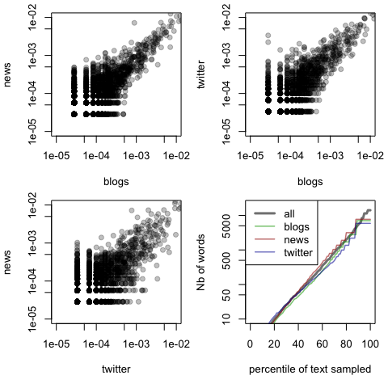
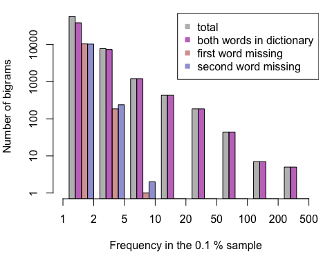
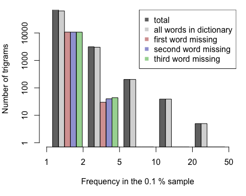

# Capstone Project: N-gram word prediction with R.
Dylan Tweed  
12/6/2016  

# Executive Summary

The goal of this Capstone project is to create an application that can predict the next word the user is most likely to type, based on the previous (1, 2 or 3 words). 
To complete this project, we shall take advantage the  [Coursera-Swiftkey data set](https://d396qusza40orc.cloudfront.net/dsscapstone/dataset/Coursera-SwiftKey.zip).

In this document we accomplish the following:

1. Create different sub-samples (0.01 to 10 % of the original data) and define necessary processing steps and tools
1. Run some exploratory analysis on word frequency, and explore variations for different documents for different sample sizes. We find that
    * 50 % of the text of the document can be sampled with 110--180 words 
    * 90 % of the text can be sampled with 6000--7500 words
1. Create a dictionary based on the most frequent words
    * The sizes of dictionaries appear converged as we increase the sample size, but depends on the document type. 
    * Due to variations in frequencies and sparsity, the lowest frequency end of the dictionary differ between documents type. Using a conservative approach across documents, requires about 9500 words to explore 90 % (on at least 1 % of the original sample)
    * We build a 6200 dictionary using a selective approach combining dictionary of the 1 % and 10 % samples. The result is representative of 87 to 91 % of any of document of our samples.
1.  Run some exploratory analysis on n-gram 
    * Explore bi-gram and tri-gram frequencies 
    * Check the impact of dictionary selection on those n-gram counts.
1. Devise a strategy and prototype of a word prediction model 

In order to keep this document more focused on results, most of the code chunk are hidden from the main body.  For reproducibility, the main functions developed for this report are displayed in the appendix. This document and related scripts are available on git hub:  [Capstone_NLP_NgramPrediction](https://github.com/BreizhZut/Capstone_NLP_NgramPrediction).

# Data 

The data consists on a collection of text documents. Each document is sample of text written in a single line. 
In order to do some basic text mining and explore the data we use the `tm` library (see [Basic Text Mining in R](https://rstudio-pubs-static.s3.amazonaws.com/31867_8236987cf0a8444e962ccd2aec46d9c3.html#just-the-basics) for more basic information).


## Source 

The data is publicly available on [CapStone DataSet](https://d396qusza40orc.cloudfront.net/dsscapstone/dataset/Coursera-SwiftKey.zip). The data is from a corpus called [HC Corpora](http://www.corpora.heliohost.org). See the read-me file at http://www.corpora.heliohost.org/aboutcorpus.html for details. 
The data is organized in 4 directories `lang` by languages:

1. English: `en_US`
1. German: `de_DE`
1. Finish: `fi_FI`
1. Russian: `ru_RU`

Each directory `lang` contains 3 files: 

1. `lang`+`.blogs.txt` 
1. `lang`+`.news.txt`
1. `lang`+`.twitter.txt`

Given the nomenclature we may refer to these documents as *blogs*, *news* and *twitter*. We may also consider these documents as different types of document. We use only the English version, the text processing we apply is thus customized to the English language. We neglect to consider misspelled and foreign words that should not be frequent enough to represent a problem, or should be considered part of the language and vocabulary if they are frequent enough. Profanity itself will be considered at the last part of this document.

## Sampling

We use the `wc` command to summarize the data:

```r
system("wc final/en_US/*.txt > wc_count") # save output to a file
wc <- read.table("wc_count")              # and read it as a data.frame
```

Table: Summary of the 'final/en_US/' data set

 Number of lines   Number of words   Number of characters
----------------  ----------------  ---------------------
          899288          37334690              210160014
         1010242          34372720              205811889
         2360148          30374206              167105338
         4269678         102081616              583077241

We create 4 sub-samples of the `US_en` data sets in separate directories:


```r
# Use a custom function to sample the data (see appendix 5.1.1)
sample_corpus("final/en_US","sample_4",1e-4,42) # 0.01 %
sample_corpus("final/en_US","sample_3",1e-3,43) # 0.1 %
sample_corpus("final/en_US","sample_2",1e-2,44) # 1 %
sample_corpus("final/en_US","sample_1",1e-1,45) # 10 %
```

1. `sample_4` 0.01 % of the data
1. `sample_3` 0.1 % of the data
1. `sample_2` 1 % of the data
1. `sample_1` 10 % of the data

# Text mining

Our objective is to build a dictionary of the most frequent words. We first have a look at this sub sample prior to apply any text transformation. To this end we create the term document matrix and look at the first few terms (words or 1-gram). 


```r
# Create a corpus instance from the sub sample
test_corpus <- Corpus(DirSource("sample_4"))
# Create a term Document Matrix and check the first terms
tdm <- TermDocumentMatrix(test_corpus,control = list(wordLengths=c(1,Inf)))
# Look at the first few terms 
head(Terms(tdm),7)
```

```
## [1] "\u0095" "-"      "--"     "---"    "–"      "—"      ","
```

## Text processing

We notice that all the first terms contains punctuation or special characters. Removing the punctuation is an important part of the processing that will remove variations of otherwise identical words as for example *"you"*, *"'you"*, *"you!"*,... As we can see directly from the list of terms extracted from this search: 

```
##  [1] "\"you"       "\"you're"    "\"your"      "“you"        "folks...you"
##  [6] "you"         "you,"        "you!"        "you!!"       "you?!"      
## [11] "you."        "you'd"       "you'll"      "you're"      "you’ll"     
## [16] "young"       "young."      "your"        "yours"       "yours."     
## [21] "yourself,"   "youtube"
```


```r
# Putting everything to lower case
clean_corpus <- tm_map(test_corpus,content_transformer(tolower))
# Applying the prefdefined transformation from the tm package
clean_corpus <- tm_map(clean_corpus,removeNumbers)
clean_corpus <- tm_map(clean_corpus,removePunctuation)
tdm_clean <-TermDocumentMatrix(clean_corpus,control = list(wordLengths=c(1,Inf)))
head(Terms(tdm_clean),14)
```

```
##  [1] "\u0095"  "½"       "a"       "aacr"    "aaron"   "aaup"    "ability"
##  [8] "able"    "aboard"  "about"   "above"   "abuse"   "academy" "accent"
```

In order to solve this issue, we first use text transformation from the `tm` package. The first entries seems to be more readable, at the exception of 2 special characters. The original term document matrix contained 3771 terms, the new one contains 3026. Numbers and punctuation removal operation did limit the size of the list of terms.
After rerunning our term search of *"you"*, we find: 

```
##  [1] "folksyou" "you"      "youd"     "youll"    "young"    "your"    
##  [7] "youre"    "yours"    "yourself" "youtube"
```

The number of corresponding entries are much lower, but some entries make less sense that the previous ones. As punctuation removal ended up concatenating words, new words are created. These words do not exist and should not be part of our dictionary.
For this reason, we implemented our custom text transformations consisting on the following steps:


* Putting the text in lower case (same as before)

```r
test_corpus <- tm_map(test_corpus,content_transformer(tolower))
```
* Remove entire words interpreted as emails, Hash tags or internet addresses

```r
# See appendix 5.1.2
test_corpus <- tm_map(test_corpus,content_transformer(remove_online_junk))
```

* Replace by a space all non alphabetical characters except ```,`’` and `‘` replaced by `'`.  (This routine is English specific, it should be customized for accents and additional letters for it to work for other language)

```r
# See appendix 5.1.2
test_corpus <- tm_map(test_corpus,content_transformer(remove_symbols))
```

* Splitting (adding a space before) short-forms (e.g.,"'ll",  "'s",...), the short forms "'m" and "n't" are neglected

```r
# See appendix 5.1.2
test_corpus <- tm_map(test_corpus,content_transformer(split_shortforms))
```

* Strip white spaces

```r
test_corpus <- tm_map(test_corpus,stripWhitespace)
```

The number of terms after each transformations

* From the original 3771 terms
* After removing emails, we get 3739 terms 
* After removing symbols, we get 3005 terms
* After splitting short forms, we get 2974 terms 
* After striping white space, we get 2974 terms

As we look at the first words we find the sames as before:

```
##  [1] "'d"      "'ll"     "'re"     "'s"      "'ve"     "a"       "aacr"   
##  [8] "aaron"   "ability" "able"    "aboard"  "about"   "above"   "abuse"
```
We can also run a third time our term search on *"you"*. 

```
## [1] "you"      "young"    "your"     "yours"    "yourself" "youtube"
```
The text processing we implement seems efficient since the words we get appear more realistic.


## Word frequencies

In the previous subsection, we implemented some text processing and tested how terms were edited by sampling the list of terms after creating a term document matrix. We now use this matrix to explore the frequency of words in our sub sample. We note that we use here the default weighting term frequency (`tf`), we could have used term frequency inverse document frequency (`tf_idf`). The later method would basically down-weight term that occur at high frequency and in many document, e.g. stop-words. 

### Finding the most frequent and least frequent words 

For exploratory analysis we now run a larger sub-sample, corresponding to 0.1 % of the total, with the same processing detailed in the previous paragraph.
We then create a data frame from the term document matrix, the rows are ordered by decreasing mean normalized frequencies in all three documents (labeled as "mean"). 


```r
# Create processed corpus from sample_3 (see appedix 5.1.3)
exp_sample <- mk_corpus("sample_3")
# Count the terms after text processing
tdm_exp    <- TermDocumentMatrix(exp_sample,control = list(wordLengths=c(1,Inf)))
# Producing the frequency data frame each column is normalized (see appendix 5.1.4)
tf_df <- convert_tdm_to_df(tdm_exp)
```

While looking at the first 10 items of the data frame, we spot the expected most common words in the English language that could be interpreted as stop-words. As we look at the 3 least common words from each documents, not all the terms we find are misspelled. Frequency, on its own, may not be able to distinguish misspelled words from genuine ones. 

Table: Most frequent words in the 0.1 % sample.

           blogs        news     twitter        mean
----  ----------  ----------  ----------  ----------
the    0.0490582   0.0562585   0.0312239   0.0455136
to     0.0277662   0.0262198   0.0257864   0.0265908
a      0.0257569   0.0257923   0.0197818   0.0237770
and    0.0280173   0.0251653   0.0141442   0.0224423
of     0.0230780   0.0225148   0.0127097   0.0194342
i      0.0222408   0.0055290   0.0251193   0.0176297
in     0.0154877   0.0193228   0.0124429   0.0157511
it     0.0134784   0.0084359   0.0126097   0.0115080
you    0.0087345   0.0043890   0.0212830   0.0114688
for    0.0101577   0.0106874   0.0129099   0.0112517

Table: Least frequent words in the 0.1 % sample.

               blogs       news    twitter       mean
---------  ---------  ---------  ---------  ---------
zinzanni    2.79e-05   0.00e+00   0.00e+00   9.30e-06
ziploc      2.79e-05   0.00e+00   0.00e+00   9.30e-06
zombies     2.79e-05   0.00e+00   0.00e+00   9.30e-06
zpass       0.00e+00   2.85e-05   0.00e+00   9.50e-06
zumwalt     0.00e+00   2.85e-05   0.00e+00   9.50e-06
zyvox       0.00e+00   2.85e-05   0.00e+00   9.50e-06
zhangke     0.00e+00   0.00e+00   3.34e-05   1.11e-05
zit         0.00e+00   0.00e+00   3.34e-05   1.11e-05
zona        0.00e+00   0.00e+00   3.34e-05   1.11e-05

Ideally, we wish to use term frequency to select words for the prediction model both as prior and as prediction. Profanity is likely to be among frequent terms. 
An other issue that appears is the sparsity of terms among documents, additionally the same word may appear at different frequencies in different documents. 

### Comparing documents


We asses the scatter on frequencies depending on the document to choose.  In the first three panels, each point in the scatter plot represent a word present in both document indicated in the axis. We find a strong correlation of words from one document to the next. On the upper right corner, we have point representing word with very high frequencies in the two documents. These words representing more than 1% of the words presents in the documents are certainly stop-words. On the lower left corner, we find increasing scatter around identity. In this range, words which are more specific or over-represented in one type of document appear shifted to the top or to the right. These words could be use to distinguish different source of materials, moreover if we were to use a different weighting scheme such as `tf_idf`, they would have a higher ranking order in the term document matrix.



The fourth panel explore how frequency can be used as a criteria to build a dictionary. Each line is computed by finding the frequency threshold above which a specific fraction of the word instance  in a document are found. We represent here the number of word we find in the different documents as a function of this thresholds. This dictionary selection method is described in appendix 5.1.2. For the 3 documents, this staircase shape is due to the fact that the frequency associated to words is discrete, with lower values being associated to larger number of words. As we search for higher completeness, we sample lower thresholds,and add larger lists of words. As the document is of limited size, the range of frequencies is limited. The combined contributions of the less frequent words (1 occurrence) may, for small samples, represent a large enough portion of the text. This lead to the saturation of the word count (all word used) above a certain percentile. 

We further explore this dictionary building with the next figure. We constructed for each document a dictionary representing 50 % of the text content, a fourth 'global' dictionary using the mean frequency representing 50 % of the words (weighted by frequency. Each point represent a word position accordingly to the mean frequency (abscissa) and to the frequency in the corresponding document (ordinate). The color code correspond to a specific document, the filled symbols show the union between the global dictionary and the document dictionary, the open symbols show the words that are in one of the two dictionary but not both. The various frequency thresholds are represented by the color coded dashed lines (horizontal for the document dictionaries, vertical for the global one).


The conclusion we draw from this exploratory graph, is that building a dictionary from different document is sensitive to the document we sample or their collection. In the left part of the figure, the open circles show words ignored by the global dictionary that would be part of the dictionary if only that document was used. The lower open symbols show words that are  in the specific document that are frequent enough in the other document to be part of the global one. This means that multiple strategies can be used for building a dictionary:

1. The most conservative approach is to use the union of the 3 document dictionaries. (all symbols)
1. The most selective approach is to use the intersection of the 3 document dictionaries. (only filled symbols)
1. Use a threshold combining a selection on all three document (right of the vertical line). 

This latest approach raises the question of how to weight the document against one another. In this test term frequency was normalized for each document before using the mean. Meaning each document had equal weight even if it contains less words. The alternative could be not to apply this normalization, meaning that a type of document which is less well sampled than the other will have much less effect on the dictionary. 


## Building a dictionary

In this section, we focus and how complete a dictionary can be. 
We first estimate haw may words are needed to represent 50% or 90% of the text. We also use our different samples to assess how this estimate is affected by the sampling.  

### Convergence of the dictionary size

We now use all our sample and produce similar data as presented in the previous paragraph. For each sample we represent the number of words needed in the dictionary as a function of the percentiles of word instances represented (completeness). The vertical lines represent the size of dictionary obtained with 50 % and 90 % completeness. The fourth combined dictionary we use for the word count is built without normalizing frequency each document. Contrary to the previous section, these dictionary could be obtained by merging all three documents. 
We note that the normalization we used in the previous section can be useful, for personalizing the dictionary (and word prediction). The dictionary could be built from a corpus of 2 documents, a large personalized one and a second composed of entries (text messages, emails...)  made by the user. As the second file expend, the dictionary will evolve focusing on frequent terms preferred by the user. 


```r
# sample_dict_lengths (see appendix 5.2.2) makes a data frame of 
# the number of words sampling various percentiles of the text.
nw_4 <- sample_dict_lengths("sample_4",perc=seq(0.,100)) #0.01 % of the data 
nw_3 <- sample_dict_lengths("sample_3",perc=seq(0.,100)) #0.1% of the data
nw_2 <- sample_dict_lengths("sample_2",perc=seq(0.,100)) #1% of the data
nw_1 <- sample_dict_lengths("sample_1",perc=seq(0.,100)) #10% of the data
```


Table: Number of words required to sample the 50 or 90 % of the various documents in the various sub samples representing 0.01 to 10 % of the complete original data-set.

                blogs   news   twitter   total
-------------  ------  -----  --------  ------
50% of 0.01%       89    128        94     118
50% of 0.1%       104    175       116     132
50% of 1%         105    179       113     131
50% of 10%        105    176       114     134
90% of 0.01%     1052   1630      1148    2974
90% of 0.1%      7039   7691      5879    6281
90% of 1%        6394   6678      4692    6704
90% of 10%       6619   7434      4524    7142

Both the figure and the table, suggest that the 0.01 % sample is insufficient. Saturation (all word used) was reached for all documents at 80 %, furthermore larger values are found for larger samples. With some variation, the number of words selected to obtain 50 % and 90 %, are quite similar for specific type of document for the various sample size. More words are needed for the news documents and the least for the twitter ones. This trend is not necessarily related to the actual size of the documents compared to one another as the variations are greater as we change document type compared to when we change the size of the sample.

### Comparing content: By document type

After comparing dictionary size, between samples and documents type, we can compare their content. We start by building dictionaries from the 3 largest samples. To accomplish this we create for each sample a data frame where
each column is a document and each row is a word. The Boolean values in each cell specifies if the word is in the dictionary. Any word neglected in all dictionary are omitted. This dictionary building function is detailed in appendix 5.2.3.


```r
# build the word selection data frame see appendix
# we don't renorm the frequencies
# the fourth column represent a concatenation of all 3 documents
dic3 <- build_dict("sample_3",perc=90,renorm=FALSE)
dic2 <- build_dict("sample_2",perc=90,renorm=FALSE)
dic1 <- build_dict("sample_1",perc=90,renorm=FALSE)
```


We then compute the union and intersection of the dictionaries based on the 3 documents. To display the result, a matrix is built showing the number of elements in 2 dictionaries (see appendix 5.2.4 for detail) . In the diagonal we find the number of words in each dictionary. The other elements represent the percentile corresponding to the column. For example we read in the 0.1 % sample matrix that 45 % of the words in the blog dictionary are in the news dictionary and that 41 % of the news dictionary are in the blog dictionary.


Table: Comparison matrix between documents for the 0.1 % sample

           union   blogs   news   twitter   total   inter
--------  ------  ------  -----  --------  ------  ------
union      14080     100    100       100     100     100
blogs         50    7039     41        45      70     100
news          55      45   7691        47      75     100
twitter       42      38     36      5879      60     100
total         45      63     61        65    6281     100
inter         14      28     26        34      32    1958


Table: Comparison matrix between documents for the 1 % sample

           union   blogs   news   twitter   total   inter
--------  ------  ------  -----  --------  ------  ------
union       9395     100    100       100     100     100
blogs         69    6394     67        77      80     100
news          72      69   6678        74      82     100
twitter       50      57     52      4692      63     100
total         72      84     82        90    6704     100
inter         33      49     47        66      46    3075


Table: Comparison matrix between documents for the 10 % sample

           union   blogs   news   twitter   total   inter
--------  ------  ------  -----  --------  ------  ------
union       9327     100    100       100     100     100
blogs         71    6619     71        84      83     100
news          80      79   7434        81      86     100
twitter       49      58     50      4524      60     100
total         77      89     83        95    7142     100
inter         37      52     47        76      48    3425

These table are interesting as they highlight the interplay between documents as we build dictionaries. As we compare he values from the 0.1 % to the large  2, we find that even though the dictionary made of sum of all documents appear fairly converged, the most conservative dictionaries (made of the union) and most selective (made of the intersection) dictionaries are not. Interestingly the number of words in the most conservative dictionary decrease as we increase the sample size with the most selective increases.  

### Comparing content: By sample size

Given the previous result, we find useful to directly compare dictionaries for different sample sizes. From each of the previous dictionary we extract the global one (made of the sum of all document), and compare the result between different sample size.


```r
# extract the list of words from each dictionary
wd1   <- row.names(dic1)[dic1$total]
wd2   <- row.names(dic2)[dic2$total]
wd3   <- row.names(dic3)[dic3$total]
# build a new one containing all words
wds  <- unique(c(wd1,wd2,wd3))
dico <- data.frame(
    "0.1 %"=  wds %in% wd3,
    "1 %"  = wds %in% wd2,
    "10%"  = wds %in% wd1,
    check.names =FALSE
)
row.names(dico) <- wds
```

Table: Comparison matrix between the different samples. Each dictionary is build by adding up each document (entry `total` in the previous tables.

         union   0.1 %    1 %    10%   inter
------  ------  ------  -----  -----  ------
union     8878     100    100    100     100
0.1 %       71    6281     71     69     100
1 %         76      75   6704     88     100
10%         81      79     93   7142     100
inter       52      73     69     65    4581
 
Even though the size of the dictionaries are similar, in term of content the variation seems to be the smallest between the 1 % and 10 % (about 90 % agreement). We find 70  to 75% correspondence between the 0.1 % dictionary and any of the other two. The variation is still large enough that, while combining dictionaries of these three samples, the most conservative approach give close to 9000 words and the most selective 4600. 
Since we suspect that the 0.1 % sample is not large enough to obtain a good approximation of a converged dictionary we proceed with this exercise focusing on the larger samples. 


Table: Same as before, focussing only on the two larger sample. Some convergence may be reached once we use 1 % of the complete data set.

         union    1 %    10%   inter
------  ------  -----  -----  ------
union     7622    100    100     100
1 %         88   6704     88     100
10%         94     93   7142     100
inter       82     93     88    6224

We read from that matrix, a 10 % deviation between dictionaries, leading to a variation between the most conservative and most selective method to be 20 %. 

### Validating a dictionary 

In the previous paragraphs we build and cross compared various dictionaries.
We first chose a dictionary. The one built from the intersection of the 2 larger samples. This dictionary is tested by computing the percentile of text represented in each document of each sample.


```r
# Create the union of dictionaries of the largest 2 samples and extract the intersection
wd12 <- unique(c(wd1,wd2))
wd0 <- wd12[wd12 %in% wd1 & wd12 %in% wd2]
# Test the dictionary for each sample, see appendix 5.2.4 for detail
val_test <- data.frame(
    "0.01 %"= validate_dict("sample_4",wd0),
    "0.1 %" = validate_dict("sample_3",wd0),
    "1 %"   = validate_dict("sample_2",wd0),
    "10 %"  = validate_dict("sample_1",wd0),
    check.names = FALSE)
```

Table: We display the measure of percentile of text represented using a dictionary build from the largest two samples. The target percentile is 90 %.

           0.01 %   0.1 %   1 %   10 %
--------  -------  ------  ----  -----
blogs          90      89    89     89
news           87      87    88     87
twitter        91      90    91     91

Even though we use the most conservative estimate combining dictionaries of the largest 2 samples, we find that it represent a percentile pretty close to the target of 90 % for any of the document we used. The type of document most badly sampled is the news at about 87 %.


## N-gram frequencies

We used the 1-gram frequencies to build our dictionary, this dictionary will be the variables of the first model we try to implement. The next stage consist on extracting the 2-gram and 3-gram frequencies that are to be the primary criteria of the model. 
To do so we first define these functions (see [`tm` FAQ](http://tm.r-forge.r-project.org/faq.html)):


```r
# Similar routine can be make through the Weka package but issues occurs with tm version 0.6 
BigramTokenizer <- function(x){
        unlist(lapply(ngrams(words(x), 2), paste, collapse = " "), use.names = FALSE)}
TrigramTokenizer <- function(x){
    unlist(lapply(ngrams(words(x), 3), paste, collapse = " "), use.names = FALSE)}
```

We keep focusing the exploratory analysis to the 0.1 % sample

```r
exp_corp <- mk_corpus("sample_3")
```

### Bigram frequencies

We find a list of bi-gram constructing a term-document matrix using bi-gram as tokens. We obtain for each type of document the number of bi-gram that follows.

```r
# use TermDocumentMatrix to find 2-gram frequencies
tdm_bg <- TermDocumentMatrix(exp_corp,control = list(
    tokenize=BigramTokenizer,
    wordLengths=c(1,Inf)))
dtype         <- get_doc_type(tdm_bg)
tdm_bg        <- as.matrix(tdm_bg)
dimnames(tdm_bg)[[2]] <- dtype
colSums(tdm_bg)
```

```
##   blogs    news twitter 
##   35834   35087   29976
```

We sum the frequencies across all document to display the most frequent bi-grams. We find that the most occurring bi-gram are made of the most frequent 1-gram or stop words. Some of the bi-gram contains short forms that we separated during text processing.


Table: Most frequent bi-gram found in the 0.1 % sample in the different documents.

           blogs   news   twitter
--------  ------  -----  --------
of the       180    201        57
in the       127    187        69
it 's         74     72        81
to the        88     85        47
on the        81     74        55
for the       57     63        75
to be         76     48        45
at the        46     64        44
in a          46     45        30
and the       46     46        18

We can now ignore the document type and combine all the document together and obtain a vector instead of a matrix. 
Then we can split the terms, and create a data frame whose columns are the first word, the second word and the frequency (here number of occurrences).
Additionally we can test whether each word is in the dictionary. We show in the next table the most and least frequent bi-grams in this data frame: 

Table: Most frequent bi-gram found in the 0.1 % sample, we check that each word is part of the dictionary

          word1   word2    freq  indic1   indic2 
--------  ------  ------  -----  -------  -------
of the    of      the       438  TRUE     TRUE   
in the    in      the       383  TRUE     TRUE   
it 's     it      's        227  TRUE     TRUE   
to the    to      the       220  TRUE     TRUE   
on the    on      the       210  TRUE     TRUE   
for the   for     the       195  TRUE     TRUE   


Table: Same as the previous table, for the least frequent terms.

                  word1     word2        freq  indic1   indic2 
----------------  --------  ----------  -----  -------  -------
zone will         zone      will            1  TRUE     TRUE   
zones provencal   zones     provencal       1  FALSE    FALSE  
zoos were         zoos      were            1  FALSE    TRUE   
zpass accounts    zpass     accounts        1  FALSE    TRUE   
zumwalt west      zumwalt   west            1  FALSE    TRUE   
zyvox mrsa        zyvox     mrsa            1  FALSE    FALSE  

As a first insight of a possible model, we can look at all the bi-gram starting by the word *"zone"*. In a 1-gram prediction model, we could use the second word in the most frequent bi-gram as our prediction. 


Table: Bi-gram stating with word 'zone'

                 word1   word2        freq  indic1   indic2 
---------------  ------  ----------  -----  -------  -------
zone can         zone    can             1  TRUE     TRUE   
zone g           zone    g               1  TRUE     TRUE   
zone immediate   zone    immediate       1  TRUE     TRUE   
zone of          zone    of              1  TRUE     TRUE   
zone president   zone    president       1  TRUE     TRUE   
zone td          zone    td              1  TRUE     FALSE  
zone to          zone    to              1  TRUE     TRUE   
zone will        zone    will            1  TRUE     TRUE   

And we see here that the frequencies are all similar, alphabetical order may not be a good choice in that case.  We can expect that using larger sample would break this ties. Alternatively the bi-gram model, using trig-grams frequencies could work, provided the word preceding these bi-grams differs.

We now explore the distribution of frequencies of bi-grams, and inquire how well bi-gram are sampled by the dictionary we build. 



We found that except for rare bi-grams occurring once or twice, both member of the bi-grams are found in the dictionary. Among the larger proportion of bi-grams (those occurring once), 67% have both words in the dictionary. For bi-grams occurring 2 to 5 times we find this percentile to be 95%.

### Trigram frequencies

We can apply the exploratory analysis we ran on bi-grams on tri-grams. Starting by evaluating the number of tri-grams for each document.


```
##   blogs    news twitter 
##   35833   35086   29975
```

We can then sum up the contributions of each document and explore the most frequent trig-grams

Table: Most frequent tri-grams in the documents of the 0.1 % sample.

                      blogs   news   twitter
-------------------  ------  -----  --------
one of the               12     14        10
it 's a                  11     11         4
thanks for the            0      0        26
a lot of                  8     12         4
looking forward to        2      1        17
as well as                9      8         1
it was a                  9      5         4
going to be               5      7         5
i 've been                9      2         5
there 's a                2     10         4

Once again we create a matrix separation our trig-grams into 3 column, and we go back to the prediction test we ran on the word *"zone"*.


Table: Tri-gram containing the word 'zone' in second position

                         word1        word2   word3        freq  indic1   indic2   indic3 
-----------------------  -----------  ------  ----------  -----  -------  -------  -------
comfort zone immediate   comfort      zone    immediate       1  TRUE     TRUE     TRUE   
discomfort zone can      discomfort   zone    can             1  FALSE    TRUE     TRUE   
euro zone to             euro         zone    to              1  TRUE     TRUE     TRUE   
flood zone of            flood        zone    of              1  TRUE     TRUE     TRUE   
memory zone will         memory       zone    will            1  TRUE     TRUE     TRUE   
red zone td              red          zone    td              1  TRUE     TRUE     FALSE  
school zone g            school       zone    g               1  TRUE     TRUE     TRUE   
war zone president       war          zone    president       1  TRUE     TRUE     TRUE   

We see that, using 2 words can remove some degeneracy in the prediction. But in many case the first word may be a stop word like *"the"* and provide no useful information.



In the next figure, the distribution of tri-gram frequencies is explored.
As we could expect from the previous result mostly tri-grams occurring only once may have at least one word missing from the dictionary. Still  69% trig-grams occurring once have all three words in the dictionary. This number reaches  97% for trig-grams occurring between 2 and 5 times.


# Building a word prediction model

We define a strategy for building a simple model. In this instance we implement some functions and method to experiment with this idea. This strategy could be used for a scaled up version of the model using 3 words as input, provide multiple suggestions. 
The prototype we build, uses only 1% of the data to be built, and only 2 words are used for input.

## Model strategy

The idea behind the model is the following

* Extract the last two words from a processed text input. 
* Match these words input in a dictionary and return a new word.

The model should then take the form of a data frame where:
    
* the first 2 columns correspond to a word in the dictionary
* the third column corresponds to the prediction (completing the most frequent tri-gram containing the first two words) 
* if no tri-gram is found we use the most frequent bi-gram where the row is the second word.
* an additional row and column are added for default (first or/and second word unknown).
* even though the words in the first columns (variables) contains profanity, profanity has to be filtered out of the prediction column (output) 


## Model creation


    
### Building the initial model 

From the exploratory analysis we made here, building the model could be as straightforward as:

1. Select a sample of the original data set
1. From this sample build a dictionary with 90 % coverage on the sum of all documents
1. From the tri-gram term document matrix, subset rows where the third word is in the list of predictions. And build a data frame with the following 4 columns
    * first word of the tri-gram
    * second word of the tri-gram
    * third word of the tri-gram (prediction)
    * frequency of the tri-gram
1. Remove from the data frame rows for which the third word should not be predicted (profanity)
1. Build the final data frame containing three column corresponding respectively to the first, second and predicted words and considering cases where:
    * both words are unknown (both first and second word would have the * value)
    * only the first is known (the second word have the * value)
    * only the second is known (the first word have the * value)
    * both words are known 
    
### Personalizing the initial model

Personalizing a word prediction model could be interesting especially once deployed in smartphone and tablets:

1. Merge the document used for the initial model into one
1. At a regular basis add a second document containing entries by the user
1. Rebuild the model (following the previous step) from the updated corpora, normalizing columns in the term document matrix and used the means across documents for dictionary building, and n-gram classification.

## Strategy implementation: First Prototype

We are now building a prototype from the 1 % sample:

```r
# Read the corpus and clean it
mod_corp <- mk_corpus("sample_2")
```

### Build the dictionnaries


```r
# Make the 1 gram term document matrix
tdm      <- TermDocumentMatrix(mod_corp,control=list(wordLengths=c(1,Inf)))
# Convert into a term frequency vector by adding the documents
words    <- Terms(tdm)
wfreq    <- rowSums(as.matrix(tdm))
# Build the dictionary
dsel     <- mk_dict(wfreq,0.9)
dic_mod  <- words[dsel]
# Derive a new dictionary with profanity removed
dic_pred <- clean_dict(dic_mod)
# Reduce the word frequency array to words in the prediction list
wfreq    <- wfreq[names(wfreq)%in%dic_pred]
# Double check for document variability
val_test <- data.frame(
    "input dictionary"=validate_dict("sample_3",dic_mod),
    "prediction dictionary"=validate_dict("sample_3",dic_pred),
    check.names=FALSE)
```

Table: Validation test of a dictionary we use for this model, it was generated using 90 % of the combined (unweighted) documents of the 1 % sample.

           input dictionary   prediction dictionary
--------  -----------------  ----------------------
blogs                    89                      89
news                     88                      88
twitter                  91                      90

This dictionary is less exclusive that the one we tested, the improvement is below the 1% level on this sample. After profanity filtering we lost 1 % completeness on the twitter document. 

### Compute and gather the tri-gram frequencies

We first search for all trig-grams as a term document matrix that we convert in to a data frame where the first three columns are, the first (first prediction variable), second (second prediction variable) and third (prediction) word of the tri-gram and the frequency the tri-gram occurs.

```r
# Clean up we keep (mod_corp,dic_mod,dic_pred,wfreq)
rm(tdm,words,dsel,val_test)
# create a trigram term documet matrix
tdm <- TermDocumentMatrix(mod_corp,control=list(
    tokenize=TrigramTokenizer,
    wordLengths=c(1,Inf)))
# combine all 
trifreq <- rowSums(as.matrix(tdm))
```

```r
# clean up
rm(mod_corp) # We won't need the corpus anymore
rm(tdm)      # We won't need the TermDocumentMatrix either
sptword <- strsplit(names(trifreq)," ")
df_trifreq <- data.frame(
    word1 = sapply(sptword,function(x){x[1]}),
    word2 = sapply(sptword,function(x){x[2]}),
    wpred = sapply(sptword,function(x){x[3]}),
    freq  = trifreq
)
rm(sptword)
rm(trifreq) # we won't need this anymore
# find words that can be selected 
selpred           <- df_trifreq$wpred %in% dic_pred
df_trifreq        <- df_trifreq[selpred,]
df_trifreq$wpred  <- as.factor(as.character(df_trifreq$wpred)) 
```

This data frame is divided into 4: 

* both first and second words are unknown


```r
selwd <- (! df_trifreq$word1 %in% dic_mod) & (! df_trifreq$word2 %in% dic_mod)
df_trifreq0 <- df_trifreq[selwd,]
# Sum up frequencies of as a function of predicted words
df_trifreq0 <- aggregate(df_trifreq0$freq,
                         by=list(df_trifreq0$wpred),FUN="sum")
names(df_trifreq0) <- c("wpred","freq")
```

* only the first word is known

```r
selwd              <- df_trifreq$word1 %in% dic_mod & (! df_trifreq$word2 %in% dic_mod)
df_trifreq1        <- df_trifreq[selwd,]
df_trifreq1$word1  <- as.factor(as.character(df_trifreq1$word1))
# Sum up frequencies of as a function of predicted words and first word
df_trifreq1        <- aggregate(df_trifreq1$freq,
                                by=list(df_trifreq1$word1,df_trifreq1$wpred),FUN="sum")
names(df_trifreq1) <- c("word1","wpred","freq")
```

* only the second word is known

```r
selwd <- (! df_trifreq$word1 %in% dic_mod) & df_trifreq$word2 %in% dic_mod
df_trifreq2 <- df_trifreq[selwd,]
df_trifreq2$word2  <- as.factor(as.character(df_trifreq2$word2))
# Sum up frequencies of as a function of predicted words and first word
df_trifreq2        <- aggregate(df_trifreq2$freq,
                                by=list(df_trifreq2$word2,df_trifreq2$wpred),FUN="sum")
names(df_trifreq2) <- c("word2","wpred","freq")
```

* both first and second words are known

```r
selwd <- df_trifreq$word1 %in% dic_mod & df_trifreq$word2 %in% dic_mod
df_trifreq3 <- df_trifreq[selwd,]
df_trifreq3$word1  <- as.factor(as.character(df_trifreq3$word1))
df_trifreq3$word2  <- as.factor(as.character(df_trifreq3$word2))
```


### Building the model data frame

We now can build a new data frame for prediction, based on the following functions:


```r
predict_most_frequent <- function(gram_select){
    # returns the most frequent third word
    # from a subset of the trigram data frame 
    if(nrow(gram_select)==1) {ipredict = 1
    } else{
        tiebreak <- wfreq[gram_select$wpred]
        ipredict <- order(gram_select$freq,tiebreak,decreasing=TRUE)[1]}
    as.character(gram_select$wpred[ipredict])
}
fetch_predictions <- function(list_freq){
    # This is a conditionnal 1 gram model
    # returns a list of predicted words as a function
    # of the word used to subset part of the trigram data frame
    prd_gram    <-c()
    for(word in names(list_freq)){
        prd_gram <- c(prd_gram,predict_most_frequent(list_freq[[word]]))}
    prd_gram
}
```

We start by the default 

```r
word_prediction <- data.frame(
    "word1"="*",
    "word2"="*",
    "prediction"=predict_most_frequent(df_trifreq0))
rm(df_trifreq0)
```

Append the predictions based on 1 word

```r
df_trifreq1 <- split(df_trifreq1,df_trifreq1$word1)
new_prediction <- data.frame(
    "word1" = names(df_trifreq1),
    "word2" = rep("*",length(df_trifreq1)),
    "prediction" = fetch_predictions(df_trifreq1))
word_prediction <- rbind(word_prediction,new_prediction)
rm(new_prediction,df_trifreq1)
```

Table: Model prediction for the default 0-gram model, and first 4 predictions for the first word based 1-gram model.

word1   word2   prediction 
------  ------  -----------
*       *       and        
'd      *       the        
'll     *       it         
're     *       and        
's      *       and        

```r
df_trifreq2 <- split(df_trifreq2,df_trifreq2$word2)
new_prediction <- data.frame(
    "word1" = rep("*",length(df_trifreq2)),
    "word2" = names(df_trifreq2),
    "prediction" = fetch_predictions(df_trifreq2))
word_prediction <- rbind(word_prediction,new_prediction)
rm(new_prediction,df_trifreq2)
```

Table: Last 5 predictions o of the second word based 1-gram model

word1   word2       prediction 
------  ----------  -----------
*       zero        per        
*       zimmerman   director   
*       zombie      then       
*       zone        in         
*       zoo         in         

And finally the 2 word prediction

```r
df_trifreq3 <- split(df_trifreq3,df_trifreq3$word1)
for(word1 in names(df_trifreq3)){
    df_bifreq <- df_trifreq3[[word1]]
    df_bifreq$word2 <- as.factor(as.character(df_bifreq$word2))
    df_bifreq <- split(df_bifreq,df_bifreq$word2)
    new_prediction <- data.frame(
        "word1" = rep(word1,length(df_bifreq)),
        "word2" = names(df_bifreq),
        "prediction" = fetch_predictions(df_bifreq))
    word_prediction <- rbind(word_prediction,new_prediction)}
    rm(df_bifreq,new_prediction)
```

Table: Last 5 predictions o of the 2-gram model

word1   word2   prediction 
------  ------  -----------
zoo     shown   no         
zoo     the     high       
zoo     two     golf       
zoo     was     an         
zoo     we      know       

This model required 2 mn to be computed on the 0.1 % sample and 16 mn on the 1 % sample, using R version 3.3.1 on a Mac Book Pro 2.9 GHz Intel Core i7. The resulting data frame has a size of 4.4 Mb. 

## Avenues of improvement

We aimed here to do the most trivial model we could come up with. This model could be expended at the cost of memory usage by either:

* Using larger dictionary:
    * Increasing the criteria to 95-99 % completeness 
    * Considering the most frequent n-grams as words
        * Add the most frequent bi-grams and tri-grams as words to the dictionary
        * At word processing level, remove the space of the most current bi-grams and tri-gram
        * Those current bi-gram and tri-gram could ether be predicted as a whole or neglected for prediction
* Using higher dimensions:
    * using a 4 gram model, using 3 word as coordinates in the matrix 
    * returning the 3 most frequent words at the end of the 3 grams.
* Applying classification on the input and deploy multiple models, requiring to first classify the input text, and use the relevant model
* Using additional input such as the first letter of the word to predict. 

In term of deployment within a shiny app, once the data frame is build and loaded the prediction algorithm ought to be fast. To improve accuracy it would be essential to match misspelled word to the dictionary. 


# Appendix

In this appendix we show the different functions used in this document.

## Sampling and text processing

### Generating sub-samples

This function to generate sub sample of randomly selected lines of each of the documents. 


```r
sample_corpus <- function(input_dir,output_dir,ratio,iseed){
    # search directory "input_dir" for "blogs, news and twitter files"
    # sample a fraction of each file
    # copy the sampled line into new files 
    # these are ramdomly assigned to the various output directories (if multiple)
    if(!dir.exists(input_dir)){stop(paste("Cannot find directory",input_dir))}
    for(output in output_dir){# create directory if it does not exist
        if(!dir.exists(output)){dir.create(output)} 
    }
    files <- list.files(path=input_dir)
    exts  <- c(".blogs.txt",".news.txt",".twitter.txt")
    set.seed(iseed)
    for(fext in exts){
        files_in <- grep(fext,files,value =TRUE)
        if(length(files_in)==0){
            stop(paste(fext,": no match in directory",input_dir))
        }
        file_in <- paste0(input_dir,"/",gsub("/","",files_in[1]))
        # read the whole file
        inpcon <- file(file_in,open='r') # open connection
        input_text <- readLines(inpcon)  # read the full file
        close(inpcon) # close connection
        # First select a fraction ratio of the text
        select <- rbinom(length(input_text),1,prob=ratio)
        nsamp  <- length(output_dir)
        if(nsamp >1){
            selected <- select==1
            select[selected] <- sample(seq(1,nsamp),sum(selected),replace=TRUE)}
        for(i in seq(1,nsamp)){
            output_text = input_text[select==i]
            file_out <- paste0(output_dir[i],"/",gsub("/","",output_dir[1]),fext)
            outcon     = file(file_out,open="w") # open connection
            writeLines(output_text,outcon)       # write file
            close(outcon) }}                     # close connection
}
```

The user specify the input directory, the output directory and the fraction of text (in terms of number of lines) to be sampled. Multiple output directories can be specified in which case the fraction of text sampled will be shared equally between sub-directories, see example:

```r
# We sample 5% of the data, and divide it into 4 training sets and on test set
sample_corpus("final/en_US/",c("cv_1","cv_2","cv_3","cv_4","test"),0.05)
```

### Customized text processing functions

We detail here the different custom build text processing function we used.


```r
remove_online_junk <- function(x){
    # replace emails and such but space
    x <- gsub("[^ ]{1,}@[^ ]{1,}"," ",x)
    x <- gsub(" @[^ ]{1,}"," ",x)
    # hashtags
    x <- gsub("#[^ ]{1,}"," ",x) 
    # websites and file systems
    x <- gsub("[^ ]{1,}://[^ ]{1,}"," ",x) 
    x
}

remove_symbols <- function(x){
    # Edit out most non-alphabetical character
    # text must be lower case first
    x <- gsub("[`’‘]","'",x)
    x <- gsub("[^a-z']"," ",x)
    x <- gsub("'{2,}"," '",x)
    x <- gsub("' "," ",x)
    x <- gsub(" '"," ",x)
    x <- gsub("^'","",x)
    x <- gsub("'$","",x)
    x
}

short_forms <- data.frame(
    "sub"=c("'d[^a-z]","'s[^a-z]"),
    "rep"=c(" 'd "," 's "))
short_forms  <- rbind(short_forms,data.frame(
    "sub"=c("'ll[^a-z]","'re[^a-z]","'ve[^a-z]"),
    "rep"=c(" 'll "," 're "," 've ")
))
split_shortforms <- function(x){
    # add a space in front of short forms
    for(isf in seq(1,nrow(short_forms))){
        x <- gsub(short_forms[isf,"sub"],short_forms[isf,"rep"],x)}
    x
}
```

### Building a processed corpus

This function creates a Corpus instance from a source directory and apply the text processing steps defined in the previous functions. The result corpus can be used for building term-document matrices (a term could be a word, a bi-gram or larger n-gram).

```r
mk_corpus <- function(dir_corpus){
    if(!dir.exists(dir_corpus)){stop(paste("Can't find directory",dircorpus))}
    # Create corpus
    corp_loc <- Corpus(DirSource(dir_corpus))
    # Apply Pre-processing
    corp_loc <- tm_map(corp_loc,content_transformer(tolower))
    corp_loc <- tm_map(corp_loc,content_transformer(remove_online_junk))
    corp_loc <- tm_map(corp_loc,content_transformer(remove_symbols))
    corp_loc <- tm_map(corp_loc,content_transformer(split_shortforms))
    tm_map(corp_loc,stripWhitespace)
}
```

### Converting term-document matrix to data frame

This routine creates a data frame form a Term Document matrix. Given that we start with 3 documents. A forth column in generated to compute the total or mean frequency for the corpus of 3 document. If requested each column can be normalized. The resulting data frame is always reordered in decreasing total (if not normalized) or mean (if normalized) frequency. This function is useful mainly for plotting purposes and having a fourth column indicating the frequencies for the corpus.  


```r
get_doc_type <- function(tdm_loc){
    # strip the names of documents 
    # return the type of each
    dtype     <- Docs(tdm_loc)
    dtype     <- sub("^[^.]{1,}.","",dtype)
    dtype     <- sub(".txt$","",dtype)
    dtype
}

convert_tdm_to_df <- function(tdm_loc, renorm=TRUE){
    # This function create a data frame out of a Term document matrix
    df_loc <-data.frame(as.matrix(tdm_loc))
    names(df_loc) <- get_doc_type(tdm_loc)
    if(renorm){
        cnorm <- colSums(df_loc)
        for(ic in seq(1,3)){
            df_loc[,ic] <-  df_loc[,ic]/cnorm[ic]
        }
        # Add extra column with the mean
        df_loc[,"mean"] <- rowMeans(df_loc)
        # And sort the term by mean frequency
        df_loc[order(df_loc$mean,decreasing=TRUE),]
    } else {
        # Add extra column with the total
        df_loc[,"total"]   <- rowSums(df_loc)
        # And sort the term by total frequency
        df_loc[order(df_loc$total,decreasing=TRUE),]}
}
```


## Creating a dictionary

### Applying frequency threshold to extract terms.

The idea of this function is given a named vector of frequencies (not necessarily ordered) return a vector of Boolean whose sum weighted by frequency is a target ratio. The criteria being a minimum frequency threshold. Since the frequency vector is derived from a term-document matrix, the result of this function can be used to subset the list of Terms and build a dictionary of terms. We note that even though we applied this function on 1-gram term document matrices, it ought to function as well on any n-gram tokenized term-document matrix.


```r
mk_dict <- function(fvect,frac){
    # fvect is a named vector of frequencies create a vector of boolean 
    # for which the frequency vector is above a threshold   
    # the sum of frequencies subset by the result should be the target fraction or above
    nvect <- sum(fvect)
    targ  <- frac*nvect
    minf  <- 0.
    maxf  <- max(fvect)
    # Trivial cases 
    if(sum(fvect[fvect>=maxf])>targ){return(names(fvect)[fvect>=maxf])}
    # Otherwise find value by dicchotomie
    it     <- 0
    medf   <- 0.5*(minf+maxf)
    cur_r  <- sum(fvect[fvect>=medf])/nvect
    delta  <- (maxf-minf)/medf
    error  <- cur_r - frac
    while(it < 100 & ((delta > 1e-3 & error > 1e-2 ) | error < 0.)){
        it <- it +1
        if(error>0){minf  <- medf
        } else {maxf <- medf}
        medf   <- 0.5*(minf+maxf)
        delta  <- (maxf-minf)/medf
        cur_r  <- sum(fvect[fvect>=medf])/nvect
        error  <- cur_r - frac}
    fvect>=medf
}
```


### Finding the number of word representing various fraction of the text

This function has for sole purpose to explore the as a function of the target percentile of text to represent with a dictionary and the number of words in the dictionary. 

```r
find_dict_length <- function(tdm_loc,perc=seq(0.,100,10.)){  
    # return a vector of integer correspesponding to the number of words 
    # representing the percentiles $perc of the term document matrix (or data frame)
    nw_loc <- data.frame("percentile" =perc)
    perc   <- perc/100.
    for(nam in names(tdm_loc)){
        termf <- tdm_loc[,nam]
        nw    <- rep(0,nrow(nw_loc))
        for(i in seq(1,length(perc))){nw[i] <- sum(mk_dict(termf,perc[i]))}
        nw_loc[nam] <- nw}
    row.names(nw_loc)<-nw_loc$percentile
    nw_loc
}
```

This function start from reading the sample, go through the processing stage before returning the result of the previous function. The `renorm` option affect criteria for the fourth column, if parameter `renorm` is set to `TRUE`, the mean normalized frequency is used, if `renorm` is set to `FALSE`, the total frequency is used

```r
sample_dict_lengths <- function(sample_dir,renorm=FALSE,perc=seq(0.,100,10.)){
    # From a  corpus directory return a data frame listing
    # the number of word neaded to represent specific percentiles of each documents.
    corp_loc <- mk_corpus(sample_dir)
    tdm_loc  <- TermDocumentMatrix(corp_loc,control=list(wordLengths=c(1,Inf)))
    # Note we do not renormalize the frequencies per document
    tdm_loc  <- convert_tdm_to_df(tdm_loc,renorm=renorm)
    # use previous function
    find_dict_length(tdm_loc,perc=perc)
}
```

### Building word selection data frame 

This function  start from reading the sample, go through the processing stage, build the term selection vector for each document and their combination and return a data frame collecting all this information. To build a dictionary, one can simply select the words corresponding to word present in one, several or all of the documents.


```r
build_dict<-function(samp_dir,perc=90,renorm=FALSE){
    # returns a data frame where 
    # each column correspond the document each row a term 
    # in at least one dictionary associated to a document 
    corp_loc  <- mk_corpus(samp_dir)
    tdm_loc   <- TermDocumentMatrix(corp_loc,control=list(wordLengths=c(1,Inf)))
    tdm_loc   <- convert_tdm_to_df(tdm_loc,renorm=renorm)
    dic_corp  <- NULL
    for(nam in names(tdm_loc)){
        d_loc <- data.frame(mk_dict(tdm_loc[,nam],perc/100.),
            row.names=row.names(tdm_loc))
        names(d_loc) <- nam
        if(is.null(dic_corp)){dic_corp <- d_loc
        }else{dic_corp <- cbind(dic_corp,d_loc)}}
    select_word <- rowSums(dic_corp)>0
    dic_corp[rowSums(dic_corp)>0,]
}
```

### Testing dictionaries

**Building the dictionary intersection matrix**

This function aims at accessing the content similarity between different dictionaries. The unions and intersections of selected dictionaries are respectively displayed is the first and last row and column of the matrix.

```r
get_comp_matrix <- function(dic_loc,comb=seq(1,3)){
    # return a matrix desplaying the intersection between row and columns
    # as perceentiles for the non-diagonal elements.
    ndim    <- ncol(dic_loc)+2
    dimn    <- c("union",names(dic_loc),"inter")
    dic_mat <- matrix(rep(rep(0,ndim),ndim),
                      ncol=ndim,nrow=ndim,
                      dimnames = list(dimn,dimn))
    intersection <- rowSums(dic_loc[,comb])==length(comb)
    union        <- rowSums(dic_loc[,comb])>=1
    dic_mat["inter","inter"] <- sum(intersection)
    dic_mat["union","union"] <- sum(union)
    dic_mat["union","inter"] <- sum(intersection)
    dic_mat["inter","union"] <- sum(intersection)
    for(namx in names(dic_loc)){
        isx <- dic_loc[,namx]
        for(namy in names(dic_loc)){
            isy <- dic_loc[,namy]
            dic_mat[namy,namx] <- sum(isx & isy)}
        dic_mat[namx,"inter"] <- sum(isx & intersection)
        dic_mat["inter",namx] <- sum(isx & intersection)
        dic_mat[namx,"union"] <- sum(isx & union)
        dic_mat["union",namx] <- sum(isx & union)}
    for(i in seq(1,ndim)){
        renorm <- seq(1,ndim) != i
        norm   <- 0.01*dic_mat[i,i]
        dic_mat[renorm,i] <- ceiling(dic_mat[renorm,i]/norm)}
    dic_mat
}
```

**Validating a dictionary from a sample**

This function returns the percentiles of text sampled given a list of words (dictionary) specified as input. 

```r
validate_dict<-function(samp_dir,words){
    # Return a vector that display for each document the percentile of text sampled 
    corp_loc  <- mk_corpus(samp_dir)
    tdm_loc   <- TermDocumentMatrix(corp_loc,control=list(wordLengths=c(1,Inf)))
    dtype     <- get_doc_type(tdm_loc)
    # this time we don't need a data frame let's use a matrix instead
    tdm_loc   <- as.matrix(tdm_loc)
    # compute the total frequencies
    tot_wd    <- colSums(tdm_loc)
    # select the part of the TermDocument matrix in the dictionary
    tdm_loc   <- tdm_loc[row.names(tdm_loc) %in% words,]
    # compute the new total 
    tot_sel   <- colSums(tdm_loc)
    # And export the percentiles as a clean data frame
    val           <- as.integer(100.*tot_sel/tot_wd)
    names(val)    <- dtype
    val
}
```

### Removing profane word

This function is useful to avoid profanity in the words we predict. From an input list of words returns a new filtered list, the list of words that are removed is language dependent.

```r
# source https://en.wiktionary.org/wiki/Category:English_swear_words
clean_dict <- function(dic_in){
    # search match for profane words in the dictionary 
    # any match is removed from the returned list of words
    # The list is hand wirtten in a seperate undisplayed chunck 
    select <- rep(TRUE,length(dic_in))
    for(bad in bad_words){select <- select & ! grepl(bad,dic_in)}
    dic_in[select]
}
```
